# Data Annotation Portfolio

Hi, I'm Atharv_Mane.  
This repository contains my data annotation samples created with CVAT.

## 📌 Skills
- Bounding Boxes (YOLO)
- Image Classification
- Quality Checking
- Dataset Organization
- Export Formats: YOLO, CVAT XML, COCO JSON

## 📂 Projects

### 1️⃣ Bounding Boxes (31 Images)
Includes:
- YOLO format annotations (.txt)
- Original images
- Screenshots showing bounding box work

Folders:
- `/Bounding_Boxes/images`
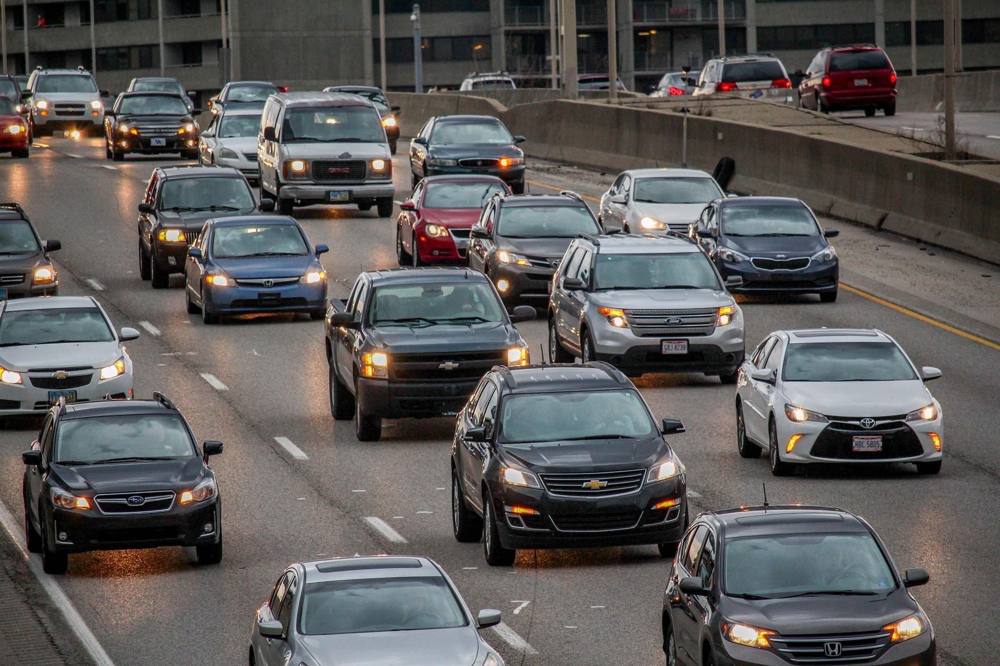

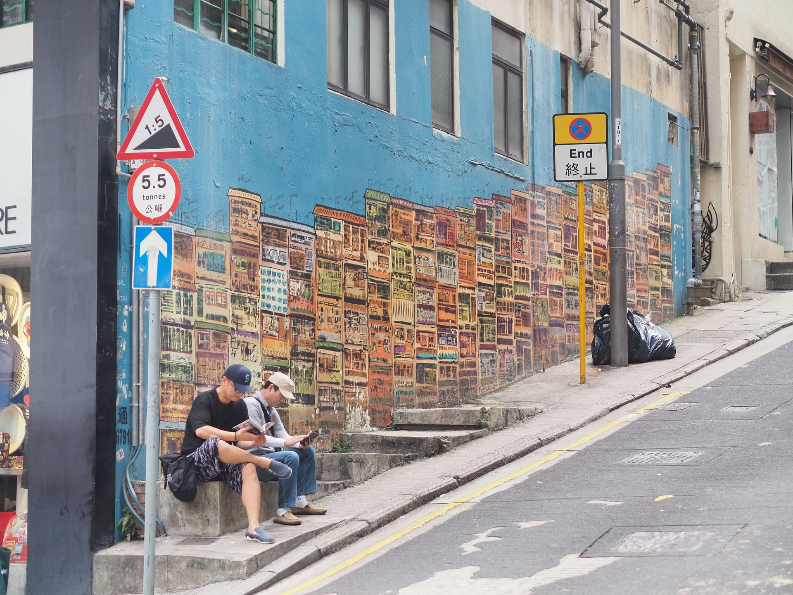

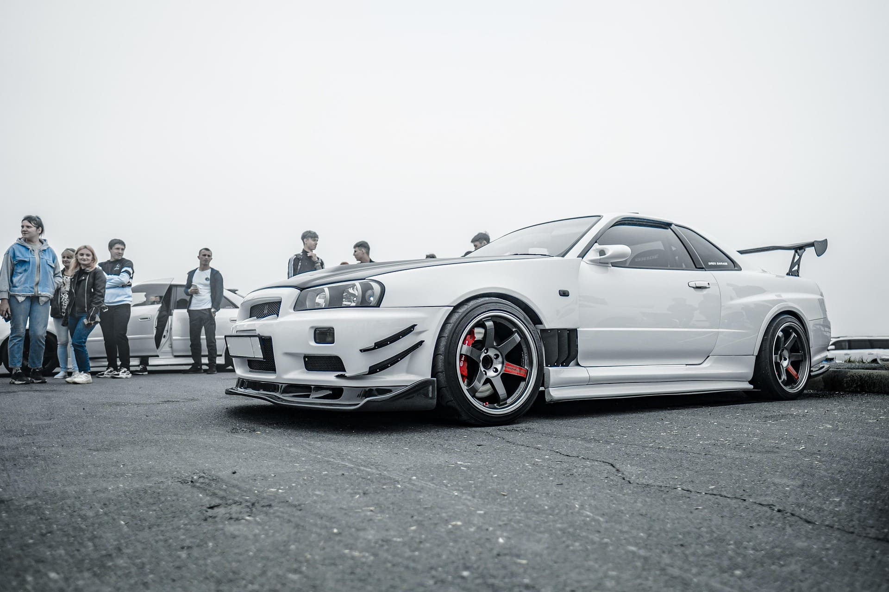

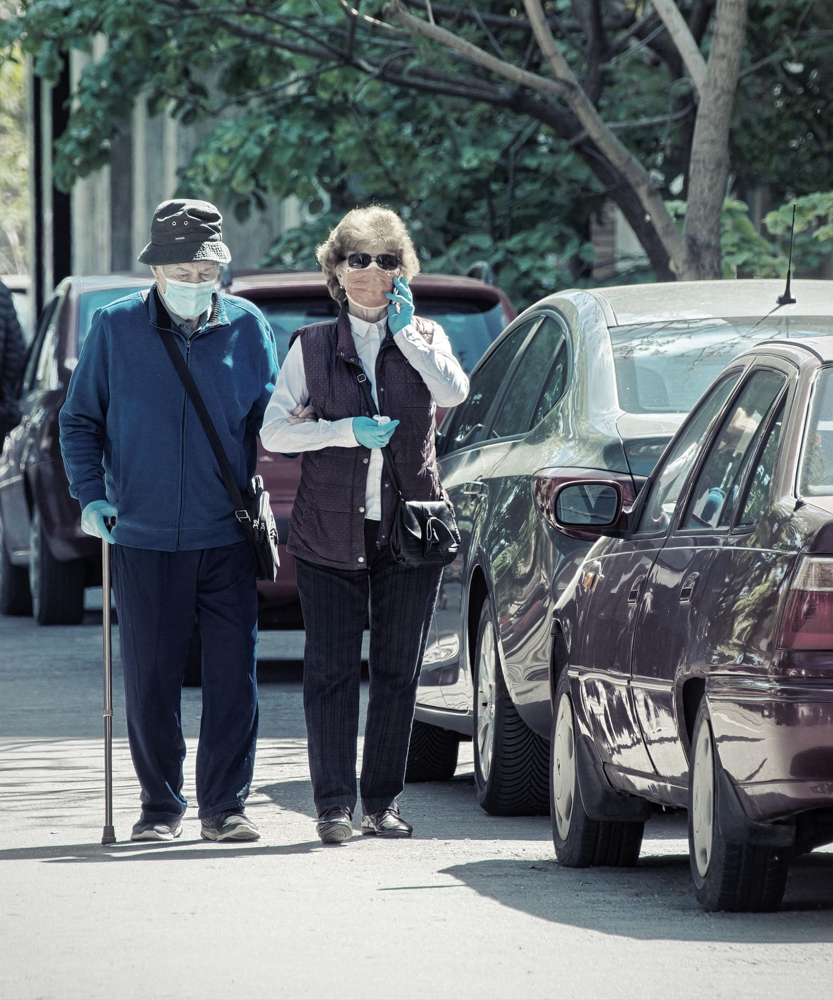

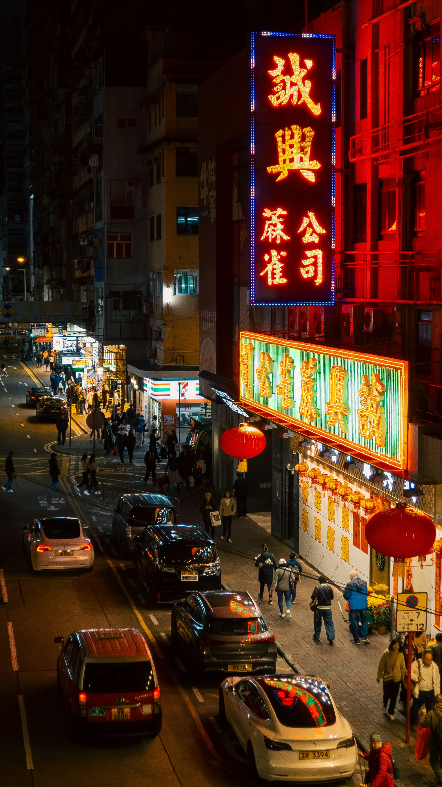

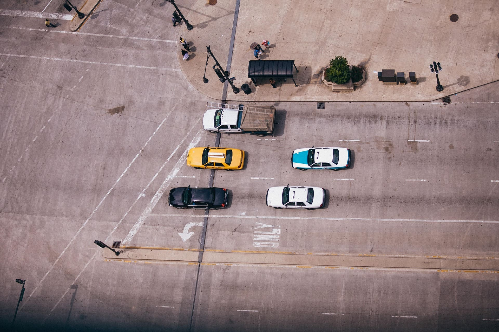

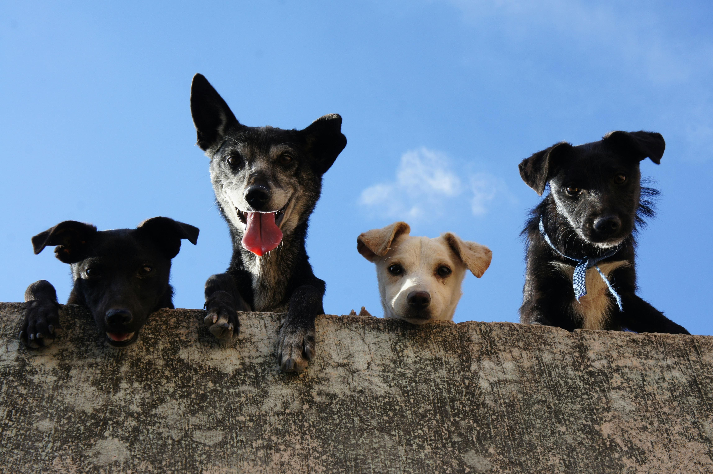

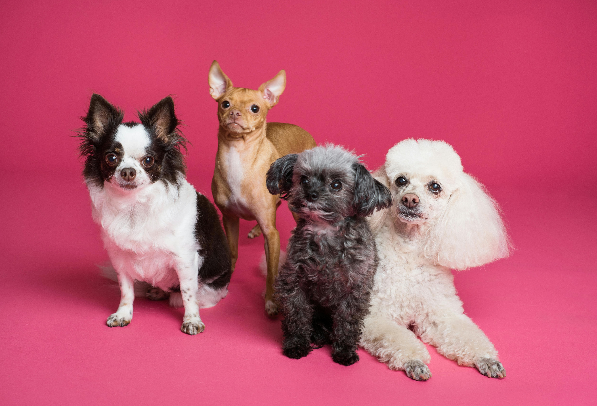

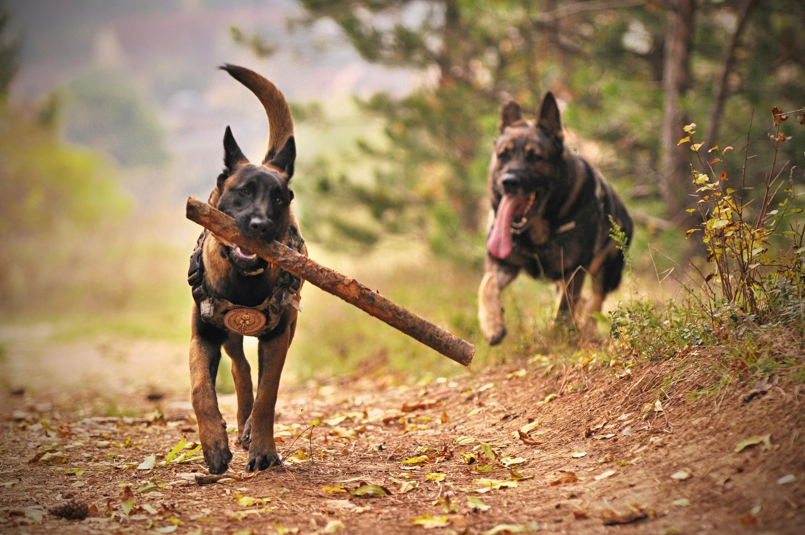

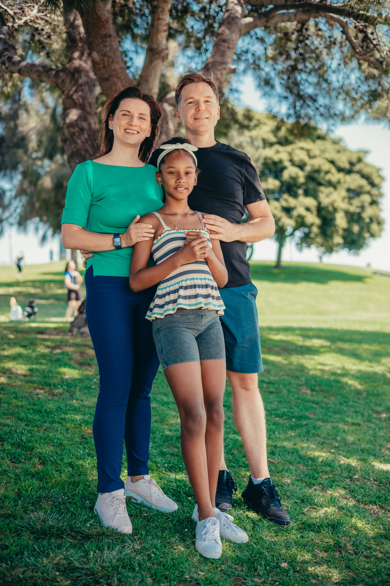

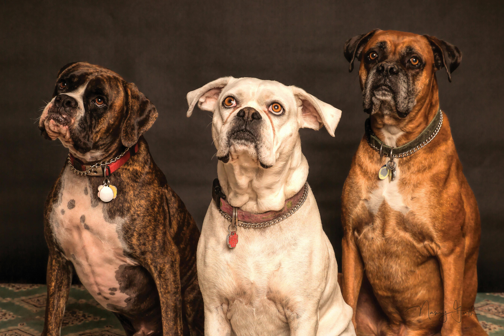

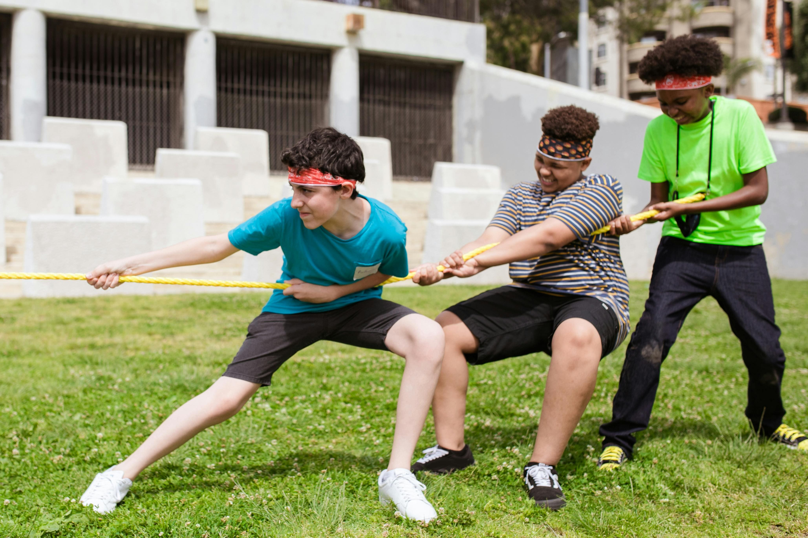

- `/Bounding_Boxes/labels`  
- `/Bounding_Boxes/examples`

## 🛠 Tools Used
- CVAT
- Label Studio

